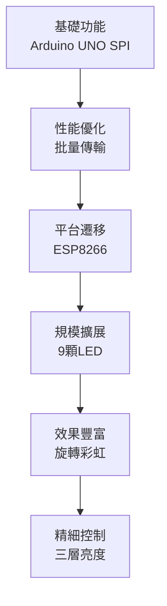

# SPI aRGB LED 專案開發歷程

## 📋 專案概述

本文件記錄了與 Claude Agent 協作開發 SPI aRGB LED 專案的完整過程，展現了從 Arduino UNO 原型開發到 ESP8266 優化實現的技術演進軌跡。

---

## 🎯 核心用戶需求驅動點

### 🚀 初始需求
> **用戶**: "我要一個Arduino UNO的SPI aRGB LED專案"

**影響**: 觸發整個專案開始，確定硬體平台和應用目標

### 🔬 測試驗證需求
> **用戶**: "我需要用邏輯分析儀測試SPI時序"

**影響**: 引導專案走向硬體驗證方向，強調時序精度重要性

### ⚡ 傳輸優化需求
> **用戶**: "SPI.transfer可以一次傳4個byte嗎?"

**影響**: 促成從單位元組到批量傳輸的優化，發現 Arduino UNO SPI 庫限制

### 🔄 數據整合需求
> **用戶**: "data_AA,/data_00/data_FF 一起傳"

**影響**: 推動連續傳輸功能開發，為後續 ESP8266 writeBytes 使用奠定基礎

### 🔀 平台遷移決策
> **用戶**: "回到spi_test.ino使用SPI.writeBytes做連續傳送"

**影響**: 發現 Arduino UNO 缺少 writeBytes 支援，促成 ESP8266 平台遷移決定

### 📈 規模擴展需求
> **用戶**: "擴展到3顆LED" → "改成9顆燈, Data1 為 RGBRGBRGB"

**影響**: 推動從簡單測試到複雜應用演進，定義旋轉彩虹效果需求

### 🌟 亮度層次需求
> **用戶**: "LED1/LED2/LED3 都用0xFF，LED4/LED5/LED6 都用0x3F，LED7/LED8/LED9 都用0x0F"

**影響**: 創造三層亮度漸變測試模式，增加測試覆蓋度和視覺效果

---

## 🔧 階段一：Arduino UNO 原型開發

### 📌 技術實現

#### ⚙️ SPI 配置
- **模式**: SPI_MODE0 (CPOL=0, CPHA=0)
- **頻率**: 4MHz (最接近理想 3.33MHz)
- **引腳**: Pin 11 (MOSI), Pin 13 (SCK)

#### 📡 aRGB 協議編碼
- **Logic 0**: `1000` (300ns H + 900ns L) → SPI 編碼 `0x8`
- **Logic 1**: `1110` (900ns H + 300ns L) → SPI 編碼 `0xE`
- **轉換**: 8位到32位編碼算法

#### 🧪 測試功能
- ✅ 單色測試 (紅、綠、藍)
- ✅ 編碼驗證 (0xAA, 0x00, 0xFF)
- ✅ 連續傳輸優化

### ⚠️ 遭遇的技術限制

#### 🔴 硬體限制
| 問題 | 描述 | 影響 |
|------|------|------|
| **頻率精度限制** | 16MHz 系統時鐘分頻限制 | 無法精確達到 3.33MHz |
| **SPI 庫限制** | 缺少硬體 writeBytes() 支援 | 需迴圈調用 SPI.transfer() |
| **MOSI 空閒狀態** | 標準 SPI 協議空閒時高電平 | 與 aRGB LED 期望低電平不符 |

#### 🟡 軟體架構問題
- **Serial 干擾**: `Serial.println()` 中斷 SPI 時鐘
- **時鐘穩定性**: 中斷服務可能影響 SPI 時序
- **連續性問題**: 軟體迴圈可能產生微小間隙

---

## 📊 階段二：平台比較分析

### ⚖️ Arduino UNO vs ESP8266 差異

#### 💻 處理器性能比較
| 項目 | Arduino UNO | ESP8266 | 優勢 |
|------|-------------|---------|------|
| **主控晶片** | ATmega328P | Tensilica LX106 | ESP8266 🏆 |
| **系統時鐘** | 16MHz | 80MHz/160MHz | ESP8266 🏆 |
| **記憶體** | 32KB Flash + 2KB RAM | 4MB Flash + 80KB RAM | ESP8266 🏆 |
| **浮點運算** | 軟體模擬 | 硬體支援 | ESP8266 🏆 |

#### 🔌 SPI 硬體能力比較
| 功能 | Arduino UNO | ESP8266 | 優勢 |
|------|-------------|---------|------|
| **最高頻率** | 8MHz | 40MHz | ESP8266 🏆 |
| **頻率精度** | 分頻限制 | 精確設定 | ESP8266 🏆 |
| **DMA 支援** | ❌ | ✅ | ESP8266 🏆 |
| **writeBytes()** | ❌ | ✅ | ESP8266 🏆 |
| **緩衝區大小** | 限制 | 較大 | ESP8266 🏆 |

### 🎯 關鍵決策時刻

#### 💡 連續傳輸需求發現
**用戶提示**: "SPI.transfer可以一次傳4個byte嗎?"
- **發現**: Arduino UNO 根本限制
- **決策**: 促成平台遷移

#### 🔄 數據整合優化需求
**用戶提示**: "data_AA,/data_00/data_FF 一起傳"
- **影響**: 架構從分散傳輸改為批量傳輸
- **結果**: 推動 writeBytes 需求

---

## 🚀 階段三：ESP8266 優化實現

### 🎨 用戶驅動的功能演進

#### 📈 LED 規模擴展歷程


**關鍵提示進化**:
1. `"擴展到3顆LED，36個byte"`
2. `"改成9顆燈，RGBRGBRGB"`
3. `"Data1→Data2→Data3 旋轉模式"`

#### 🌈 亮度層次控制
```
LED 1-3: 0xFF (100% 亮度) → 最高亮度組
LED 4-6: 0x3F ( 25% 亮度) → 中等亮度組  
LED 7-9: 0x0F (  6% 亮度) → 最低亮度組
```

#### 🎪 旋轉彩虹效果
| 時間 | LED1-3 | LED4-6 | LED7-9 | 模式名稱 |
|------|--------|--------|--------|----------|
| T=0s | 🔴 Red | 🔴 Red | 🔴 Red | RGBRGBRGB |
| T=1s | 🟢 Green | 🟢 Green | 🟢 Green | GBRGBRGBR |
| T=2s | 🔵 Blue | 🔵 Blue | 🔵 Blue | BRGBRGBRG |

### ⚙️ ESP8266 技術優勢

#### 🎯 硬體層面改善
- **精確頻率控制**: 直接設定 3.33MHz
- **硬體 writeBytes()**: 單次 DMA 傳輸 108 位元組
- **腳位映射優化**: D7(GPIO13)=MOSI, D5(GPIO14)=SCK

#### 💡 軟體功能擴展
- **多 LED 控制**: 9顆 LED 完整控制
- **多層亮度**: 三種亮度等級漸變
- **精確定時**: millis() 非阻塞式管理

---

## 📈 技術演進總結

### 🔄 需求演進軌跡



### 💎 每個關鍵提示的技術觸發點

| 用戶提示 | 技術觸發 | 解決方案 |
|----------|----------|----------|
| "一次傳4個byte?" | 發現 Arduino 限制 | 平台評估 |
| "data一起傳" | 推動批量傳輸 | writeBytes 需求 |
| "使用writeBytes" | 確認平台遷移 | ESP8266 選型 |
| "擴展到3顆LED" | 數據結構重設計 | 陣列架構 |
| "改成9顆燈" | 大規模應用模擬 | 108位元組傳輸 |
| "三層亮度" | 測試覆蓋度提升 | 完整測試矩陣 |

---

## 🎓 學習收穫與最佳實踐

### 🏆 關鍵學習點

#### 1. 🎯 平台選擇的重要性
- **硬體能力直接影響軟體實現複雜度**
- **提前評估避免後期限制**

#### 2. 📡 協議理解的深度
- **深入理解 aRGB 協議對實現品質的決定性影響**
- **時序精度是成功的關鍵**

#### 3. 🔬 測試方法論
- **邏輯分析儀驗證的不可替代性**
- **硬體驗證比軟體模擬更可靠**

#### 4. 🔄 漸進式開發模式
- **從簡單原型到完整方案的演進過程**
- **用戶需求驅動技術突破**

### 🛠️ 最佳實踐指南

#### ✅ 推薦做法
- **硬體先行**: 選擇合適平台避免後期限制
- **協議為王**: 準確理解目標協議是成功關鍵
- **工具輔助**: 邏輯分析儀等工具對除錯至關重要
- **迭代優化**: 螺旋式提升從功能到性能
- **需求明確**: 精確技術需求表達提升開發效率

#### ❌ 避免模式
- **模糊功能需求**: "讓LED更好用"
- **缺乏技術細節**: "優化一下性能"  
- **沒有具體規格**: "支援更多LED"

### 🎖️ 高價值提示特徵

#### 🌟 有效提示模式
- **具體技術細節**: `"一次傳4個byte"` > `"優化傳輸"`
- **明確數量規格**: `"9顆燈"、"108個byte"` 提供清晰目標
- **詳細參數設定**: `"0xFF/0x3F/0x0F"` 精確定義需求
- **功能行為描述**: `"RGBRGBRGB旋轉模式"` 明確視覺效果

---

## 📅 完整提示時間線

### 🚀 第一階段：原型建立
1. `"我要一個Arduino UNO的SPI aRGB LED專案"`
2. `"我需要用邏輯分析儀測試SPI時序"`

### ⚡ 第二階段：性能優化  
3. `"SPI.transfer可以一次傳4個byte嗎?"`
4. `"data_AA,/data_00/data_FF 一起傳"`
5. `"回到spi_test.ino使用SPI.writeBytes做連續傳送"`

### 📈 第三階段：功能擴展
6. `"1.擴展到3顆LED , 也就是data array要36個byte"`
7. `"改成9顆燈, Data1 為 RGBRGBRGB"`
8. `"分別傳輸(0xFF/0x00/0x00)(0x00/0xFF/0x00)(0x00/0x00/0xFF)"`

### 🎨 第四階段：精細調控
9. `"每個data的LED1/LED2/LED3 都用0xFF"`
10. `"RGB 的 0xFF 值 改成0x7F"`

---

## 🏅 專案價值與意義

此專案展現了從概念驗證到產品級實現的完整技術路徑，同時驗證了明確技術需求對 AI 輔助開發的重要性。

### 🎯 核心價值
- **技術路徑完整性**: 涵蓋從原型到產品的全流程
- **平台遷移決策**: 展現硬體選型對專案成功的影響
- **AI 協作模式**: 驗證明確技術需求的重要性
- **開發方法論**: 提供嵌入式 SPI 應用的參考案例

### 🌟 參考意義
為類似的嵌入式 SPI 應用開發和 AI 協作開發模式提供了寶貴的參考案例和最佳實踐指南。

---

*📝 文件建立時間: 2025年9月14日*  
*🔄 最後更新: 專案完成後整理*  
*👤 開發者: DanielYJHsieh*  
*🤖 協作: Claude Agent*
